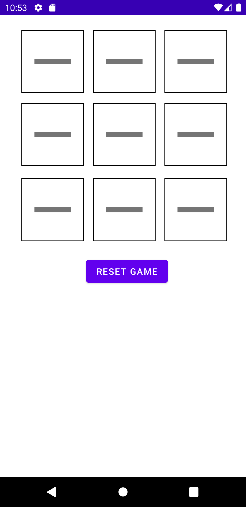
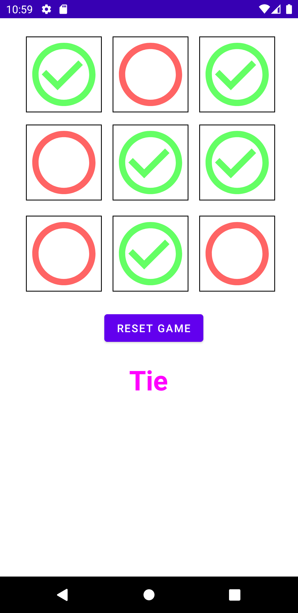

# Tic-Tac-Toe

Android [Tic-Tac-Toe](https://de.wikipedia.org/wiki/Tic-Tac-Toe) adaptation, which uses [Vector-Assets](https://developer.android.com/studio/write/vector-asset-studio) for the fields.

    &nbsp;&nbsp;
    &nbsp;&nbsp;
    &nbsp;&nbsp;
    &nbsp;&nbsp;
    &nbsp;&nbsp;
    

